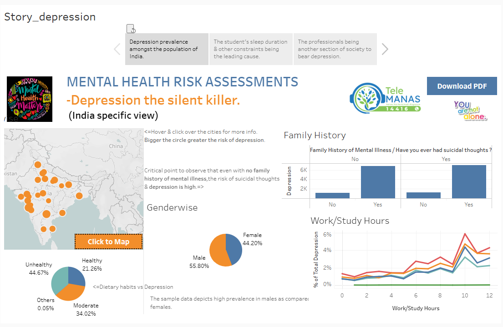
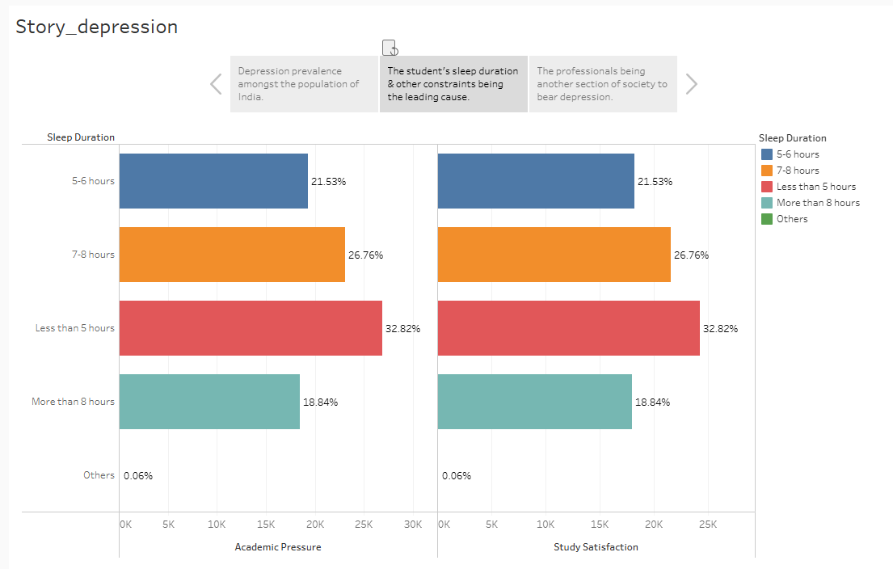

# Mental_Health_story_dashboard
# Mental Health Risk Assessments - Depression the silent killer ( India specific view )
## 📊 Dashboard Overview
I'm thrilled to unveil my dashboard using Tableau Public-A data visualisation and business intelligence tool!
Built an interactive dashboard in Tableau using Kaggle dataset on mental health risk factors.
This report synthesizes findings by exploring the intersection of sleep duration, academic and job satisfaction, financial stress, and depression trends in India amongst students and professionals. The visualizations offer a compelling narrative on how behavioral and demographic factors influence mental health and well-being.

### Why this matters?
In today's fast paced life,mental health is least taken care of,which requires the utmost priority.Hence the sample data so collected helps in bringing a little clarity to bring about the incentives and reforms accordingly.
---

👉 👉 👉 **📘 [Check Dashboard Here](https://public.tableau.com/app/profile/swati.singh8088/viz/Mental_Health_story/Story_depression)**👈 👈 👈

---

### Components Analysed
- Map of India showing regional depression indicators.
- Family History vs Suicidal Thoughts bar chart.
- Genderwise distribution pie chart.
- Work/Study Hours vs Depression Risk line chart.
- Health Status breakdown.

### 🗺 Map of India
- Regional variation in depression prevalence is visually represented, though specific state-level data isn’t labeled.
- The orange-highlighted region suggests a concentration of responses or higher depression indicators.
- Maharashtra suggests the higher percentage of total depression i.e. 13.16%.

ACTIONABLE RECOMMENDATIONS:
1. State-Level Mental Health Surveillance
- Deploy targeted surveys and screenings in Maharashtra and other high-risk regions to validate and expand on dashboard findings.
- Collaborate with local health departments and NGOs to collect granular data (district-level, urban vs rural).
2. Localized Awareness Campaigns
- Launch region-specific mental health campaigns in Maharashtra, using vernacular language and culturally relevant messaging.
- Partner with schools, colleges, and workplaces to promote early detection and destigmatization.
3. Mental Health Infrastructure Expansion
- Increase funding for mental health clinics, helplines, and counseling centers in Maharashtra and similarly affected states.
- Train community health workers to identify and refer individuals showing signs of depression.
4. Policy Advocacy & Data Transparency
- Advocate for state-wise mental health reporting in national health dashboards and census updates.
- Encourage open data sharing between public health bodies and researchers to enable predictive modeling and intervention planning.
5. Digital Outreach & Teletherapy
- Promote telehealth platforms in Maharashtra to reach underserved populations, especially in semi-urban and rural areas.
- Use mobile apps and WhatsApp-based check-ins to offer low-barrier access to mental health support.

### 📊 Bar Chart – Family History vs Suicidal Thoughts
- Respondents with no family history of mental illness report the highest percentage (~2.5%) of suicidal thoughts.
- Those with a confirmed family history show slightly lower (~2.0%), and “no” responses are the lowest (~1.5%).
- Inference: Depression and suicidal ideation can occur independently of family history, highlighting the need for broader mental health screening.

ACTIONABLE RECOMMENDATIONS:
1. Expand Mental Health Screening Criteria
- Institutions (schools, workplaces, clinics) should not limit mental health assessments to those with known family history.
2. Normalize Universal Mental Health Checkups
- Promote routine mental health checkups for all individuals, similar to physical health screenings.
- Early detection can prevent escalation, especially among those who may not recognize their symptoms due to absence of familial context.
3. Design Inclusive Awareness Campaigns
- Mental health campaigns should avoid messaging that targets only “at-risk” families and instead emphasize that anyone can experience depression.
- This reduces stigma and encourages broader participation in support programs.
4.  Promote Peer-Led Support Systems
- Encourage peer mentorship and support groups that don’t rely on clinical or familial background.
- Individuals without family history may benefit more from community-based empathy and shared experiences.

### 👥 Genderwise Distribution
- Male: 55.80%
- Female: 44.20%
- Inference: Depression appears to affect more males in this dataset, which may reflect underreporting among females, cultural stigma, or genuine demographic trends. It challenges the stereotype that depression is more prevalent among women.

ACTIONABLE RECOMMENDATIONS:
1. Reframe Mental Health Messaging for Men
- Design campaigns that normalize emotional vulnerability among men, using relatable male role models and culturally sensitive language.
2. Encourage Anonymous and Digital Reporting Tools
- Promote anonymous surveys, chatbots, and teletherapy platforms to reduce barriers for men who may hesitate to seek help publicly.
3. Train Male-Dominated Workplaces in Mental Health First Aid
- Implement mental health awareness workshops in sectors with high male employment (e.g., manufacturing, logistics, tech).
- Workplace culture can either reinforce or reduce stigma—training helps managers and peers recognize signs and respond supportively.
4. Investigate Underreporting Among Women
- Conduct qualitative studies and focus groups to understand if cultural or familial pressures are suppressing female reporting.
- The lower female percentage may not reflect actual prevalence but rather social silencing, especially in conservative or rural settings.

### 🍎 Health Status
- Unhealthy: 44.20%
- Healthy: 55.80%
- Inference: A slightly higher proportion of respondents identify as healthy, but the unhealthy group still forms a significant chunk. This suggests that physical health alone doesn’t shield against depression, and mental health needs independent attention.

ACTIONABLE RECOMMENDATIONS:
1. Decouple Mental Health from Physical Health in Screening Protocols
- Design independent mental health assessments rather than bundling them with physical health checkups.
- The data shows that even those who consider themselves physically healthy may experience depression, which can go undetected if mental health is only screened when physical symptoms are present.
2. Promote Mental Health Literacy Among the “Healthy” Population
- Launch awareness campaigns that emphasize: “You can feel mentally low even when physically fit.
3. Integrate Mental Health Modules into Fitness and Wellness Programs
- Encourage gyms, yoga studios, and wellness apps to include mental well-being check-ins, mood tracking, or guided therapy content.
4. Train Healthcare Providers to Recognize Psychological Red Flags
- Equip general physicians and fitness coaches with basic mental health screening tools and referral protocols.
5. Leverage Workplace Wellness Programs
- Ask employers to include mental health resources in employee wellness benefits, even for those who pass physical health screenings.

### 📈 Line Chart – Work/Study Hours
- Depression-related responses peak around 6–8 hours of work/study per day, with percentages nearing 14%.
- Very low (0–2 hours) and very high (9–10 hours) work/study durations show lower depression indicators.
- Inference: There may be a stress threshold—moderate workloads might correlate with higher mental strain, while very low or very high hours could reflect different coping mechanisms or lifestyle factors.

ACTIONABLE RECOMMENDATIONS:
1. Identify and Monitor the “Stress Threshold” Zone
- Institutions should flag individuals consistently working/studying 6–8 hours daily for routine mental health check-ins.
2. Promote Structured Breaks and Recovery Time
- Encourage mid-day breaks, mindfulness sessions, or light physical activity for those in the 6–8 hour range.
- These interventions can buffer stress accumulation and improve emotional resilience without reducing productivity.
3. Customize Workload Distribution
- Use this insight to redesign academic and workplace schedules, balancing intensity with recovery.
- Avoid clustering demanding tasks within the 6–8 hour window—spread cognitive load across the day or week.
4. Investigate Coping Mechanisms in Low and High Hour Groups
- Conduct qualitative studies to understand why 0–2 hour and 9–10 hour groups report lower depression.
- These groups may have adaptive routines, support systems, or disengagement strategies worth replicating in the mid-hour group.
5. Integrate Mental Health Prompts into Time-Tracking Tools
- Add mood check-ins or stress indicators to apps that track work/study hours (e.g., Pomodoro timers, productivity tools).
6. Educate on Quality vs Quantity of Effort
- Promote the idea that mental strain isn’t just about hours—it’s about intensity, environment, and emotional load.
- This helps users and managers reframe productivity and reduce guilt or pressure tied to time-based metrics.

---

The chart offers a compelling snapshot of how sleep duration correlates with both academic pressure and study satisfaction—and interestingly, the percentages are identical across both dimensions. Here's what we can infer:
📊 Key Observations
- Students sleeping less than 5 hours report the highest levels of academic pressure (32.66%) and lowest study satisfaction, suggesting sleep deprivation may be linked to stress and dissatisfaction.
- 7–8 hours of sleep is associated with lower academic pressure (26.76%) and higher satisfaction, indicating this range might be optimal for well-being and performance.
- More than 8 hours of sleep shows the lowest academic pressure (18.84%), but not the highest satisfaction—possibly hinting at oversleeping or other factors affecting engagement.
- 5–6 hours sits in the middle, with moderate pressure and satisfaction (21.53%).
- The "Others" category is negligible (0.06%), likely representing outliers or missing data.
🧠 Inference
There’s a clear inverse relationship between sleep duration and academic pressure: less sleep = more pressure. At the same time, adequate sleep (7–8 hours) seems to support better study satisfaction. This reinforces the idea that sleep isn’t just a health metric—it’s a predictor of academic experience.

ACTIONABLE RECOMMENDATIONS:
1. Integrate Sleep Education into Academic Wellness Programs
- Schools and universities should include sleep hygiene modules in orientation, counseling, or health classes.
- Students sleeping less than 5 hours report the highest academic pressure and lowest satisfaction (32.66%), indicating that sleep deprivation directly impacts emotional and cognitive performance.
2. Promote 7–8 Hour Sleep Targets as Academic Best Practice
- Frame 7–8 hours of sleep as the optimal range for academic success in student handbooks, wellness apps, and peer mentoring.
- This group shows lower pressure (26.76%) and higher satisfaction, making it a strong benchmark for performance and well-being.
3. Use Sleep Metrics in Academic Stress Monitoring
- Include sleep duration questions in periodic student stress surveys or digital check-ins.
4. Design Study Schedules That Respect Sleep Cycles
- Encourage faculty and coaching centers to avoid scheduling late-night sessions or early morning deadlines.
5. Investigate Oversleeping and Engagement Gaps
- Conduct follow-up studies on students sleeping more than 8 hours, who show lowest pressure (18.84%) but not highest satisfaction.
- This may reveal underlying disengagement, mental fatigue, or lifestyle issues that need tailored support.
6. Empower Peer-Led Sleep Awareness Campaigns
- Launch student ambassador programs to promote sleep-health through social media, posters, and dorm events.

---

This chart reveals a consistent and telling relationship between sleep duration, job satisfaction, and financial stress—and just like the previous chart, the percentages are identical across both dimensions. Here's what we can infer:

🧠 Core Insights
- Less than 5 hours of sleep is associated with the highest financial stress (32.82%) and lowest job satisfaction, suggesting that sleep deprivation may be both a symptom and a contributor to workplace dissatisfaction and financial anxiety.
- 7–8 hours of sleep shows the highest job satisfaction (26.76%) and relatively lower financial stress, reinforcing the idea that this sleep range supports better emotional and professional well-being.
- More than 8 hours of sleep corresponds to the lowest financial stress (18.84%), but not the highest job satisfaction—possibly indicating that while longer sleep may reduce stress, it doesn't necessarily boost engagement or fulfillment at work.
- 5–6 hours sits in the middle (21.53%), showing moderate levels of both stress and satisfaction.
- "Others" is negligible (0.06%), likely representing edge cases or missing data.

📌 Inference Summary
There’s a dual pattern here:
- Short sleep (<5 hours) → High stress, low satisfaction
- Optimal sleep (7–8 hours) → Balanced stress and satisfaction
- Long sleep (>8 hours) → Low stress, but not peak satisfaction
This suggests that sleep duration is not just a health metric—it’s a proxy for overall life balance, influencing both emotional resilience and workplace experience.

ACTIONABLE RECOMMENDATIONS:
1. Integrate Sleep Metrics into Employee Wellness Programs
- Encourage organizations to include sleep tracking and education in their wellness initiatives.
- Employees sleeping less than 5 hours report highest financial stress and lowest job satisfaction (32.82%), making sleep a critical indicator of burnout and disengagement.
2. Promote 7–8 Hour Sleep Targets as a Productivity Standard
- Frame 7–8 hours of sleep as the optimal range for emotional resilience and professional performance in HR handbooks and onboarding materials.
3. Use Sleep Duration as a Screening Variable in Employee Surveys
- Add sleep-related questions to periodic employee engagement and stress assessments.
4. Design Flexible Work Schedules to Support Sleep Hygiene
- Offer flexible start times, remote work options, and no-meeting blocks to help employees maintain healthy sleep routines.
- Reducing rigid scheduling can help employees avoid sleep deprivation, which is linked to low satisfaction and high stress.
5. Investigate Engagement Gaps Among Long Sleepers
- Conduct follow-up interviews or pulse surveys with employees sleeping more than 8 hours, who show lowest financial stress (18.84%) but not peak satisfaction.
6. Educate Managers on Sleep-Related Performance Signals
- Train team leads to recognize signs of sleep deprivation and its impact on morale, decision-making, and interpersonal dynamics.
- Managers are often the first to notice shifts in behavior—equipping them with sleep-awareness tools enhances early intervention.

---

👉 👉 👉 **📘 [Check Dashboard Here](https://public.tableau.com/app/profile/swati.singh8088/viz/Mental_Health_story/Story_depression)**👈 👈 👈

---

## 👨‍💻 Author  
**Swati Singh**  

📧 [swati.autodidact@gmail.com](mailto:swati.autodidact@gmail.com)  
🔗 [LinkedIn Profile](https://www.linkedin.com/in/swatisinghlink/)  

---

